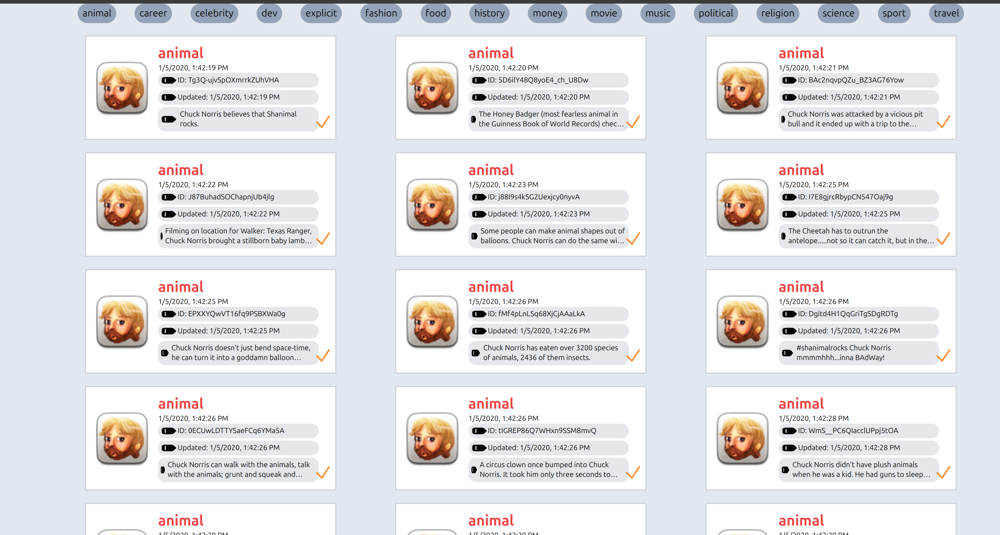
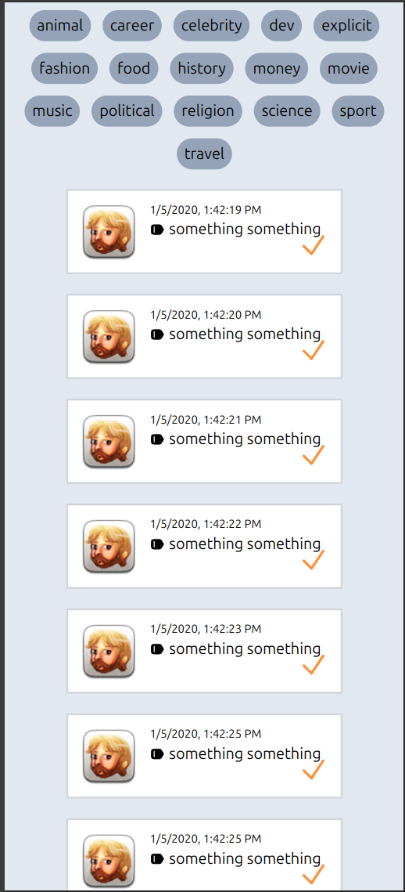

# Vue 3 + Vite + TailwindCSS

Based on my answer to the requirements of this project, here are some recommendations on how I would improve it:
- include unit and integration tests. (unit tests via vite test and integration tests via playwright)
- I would include pagination, for cases of longer lists

## Screenshots

