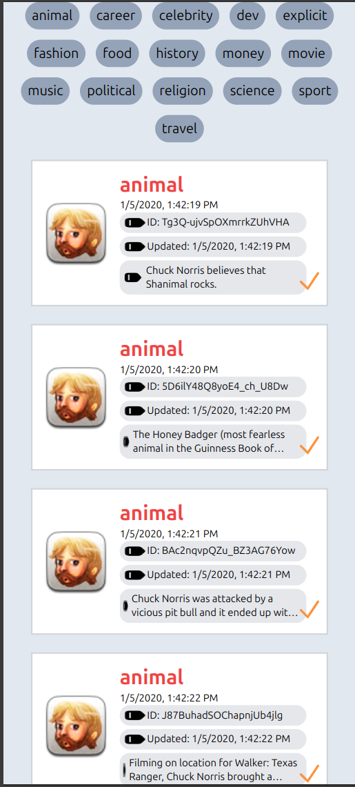

# Vue 3 + Vite + TailwindCSS

Based on my answer to the requirements of this project, here are some recommendations on how I would improve it:
- include unit and integration tests. (unit tests via vite test and integration tests via playwright). This will allow for maintainability as future edits on the code will make sure that breaking changes are easy to notice before shipping.
- I would include pagination, for cases of longer lists; so as to imporve user experience.
- Polish styling of the page to ensure it looks better on all screen sizes.

## Screenshots

